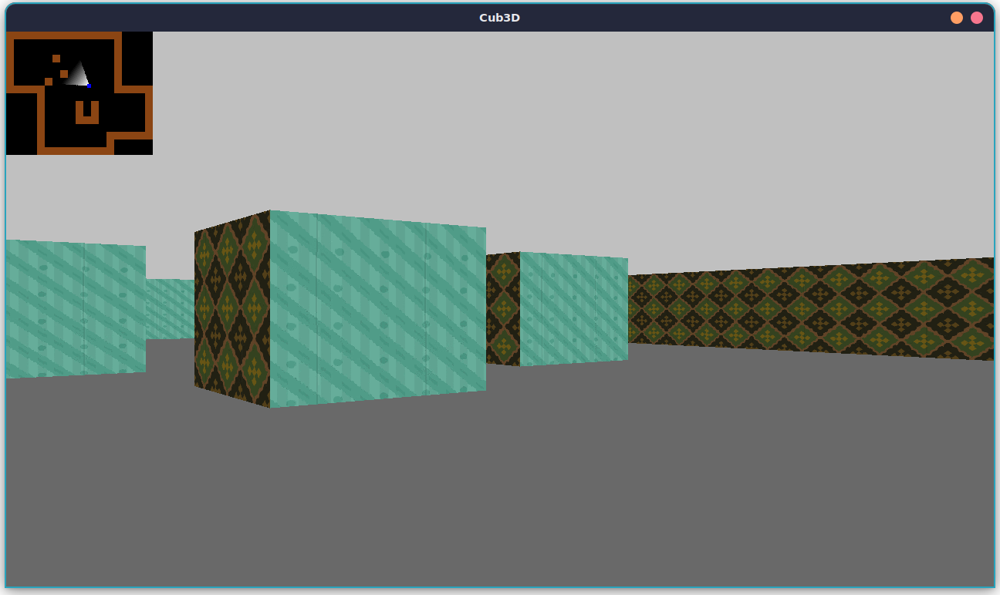

# cub3d

## About
This is another project by [Reem](https://github.com/ReemEssamEldin) and [Howard](https://github.com/howset).

## The Project
The project is about raycasting which can be taken as projecting a 2D based game to a first-person view game. The basis is stil a 2D game of a player inside a map enclosed by walls. The player can move around the map and change directions. The projection to a first-person view is done by drawing lines from a point in the map (the player's eyes) towards walls within a certain angle Field of View (FOV - ~60 degrees). This FOV defines the whole screen area which will be filled by drawing a vertical line from the top of the screen to the bottom. The lines are then drawn pixel-by-pixel only in the x-coordinate. Longer lines translates to lower wall height and conversely, shorter lines means higher walls.

The bonus included are:
1. Collision detection (already integrated in the mandatory, without it the mandatory will segfault if the player clips the outside walls)
2. Minimap
3. Audio play

## Docs
[[Documentation](./docs/MAIN.md)] for each module. Rather a general overview. Specific function documentation is to be examined on the function's implementation itself.

## Sources
#### Tutorial
- https://lodev.org/cgtutor/
- https://permadi.com/1996/05/ray-casting-tutorial-table-of-contents/
- https://timallanwheeler.com/blog/2023/04/01/wolfenstein-3d-raycasting-in-c/
- https://www.youtube.com/watch?v=G9i78WoBBIU --> useful but a bit misleading
- https://github.com/BEQSONA-cmd/RayCaster/tree/main --> useful but a bit misleading
